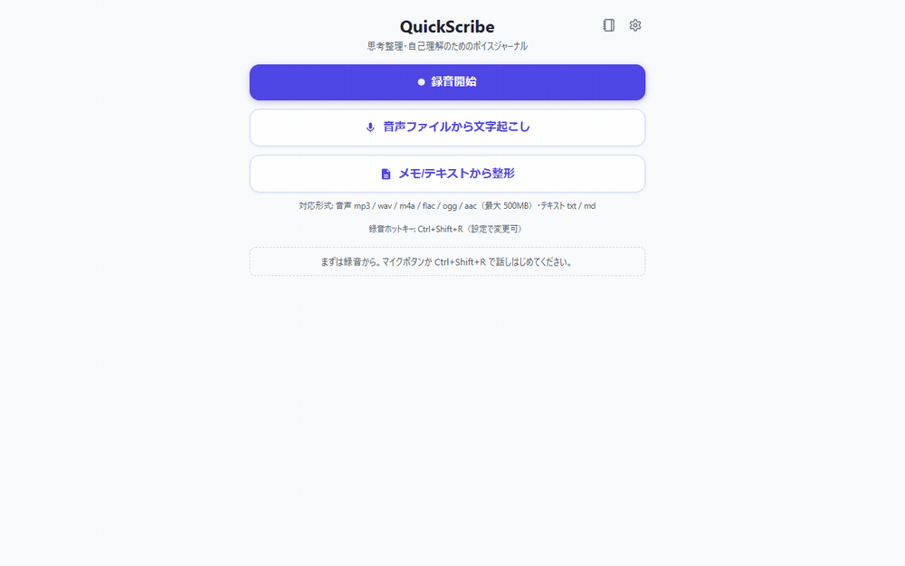
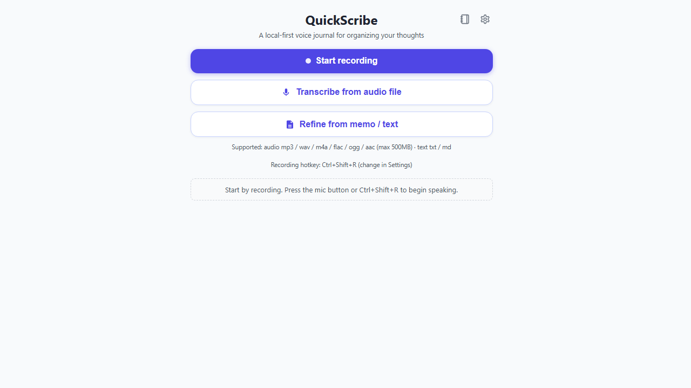

# QuickScribe

日本語: [README.md](README.md)

**A local-first voice journal for organizing your thinking and understanding yourself.**
Speak your mind, and QuickScribe intelligently refines and summarizes it — while keeping your nuance — so you can organize your own thoughts.

> Documentation site (English): **[https://takenori-kusaka.github.io/QuickScribe/en/](https://takenori-kusaka.github.io/QuickScribe/en/)**

> The demo GIF and screenshots are generated automatically in **CI (Vite + Playwright, with the Tauri IPC mocked)** — see `.github/workflows/screenshots.yml`.

## What is QuickScribe

QuickScribe is a voice journal for organizing your spoken thoughts **entirely on your device**, refining them **while keeping their nuance**, so you can make sense of your own thinking. Its core value is not transcription accuracy itself, but the **intelligence to organize thought while preserving nuance**.

- 🎙 **Record → transcribe → refine** in one flow. Start quickly with a physical button (global hotkey).
- 🧠 **Nuance-preserving refinement**: hesitations and second thoughts are not erased — the flow of your thinking stays intact while the text becomes readable. A term-check step lets you review and replace mis-transcriptions.
- 🔒 **Local-first, privacy by default**: recording and local transcription happen on your device. **Audio is never sent anywhere by default.** Cloud integrations are strictly opt-in.
- 🗂 **Journal**: entries are saved as plain Markdown / text. Reflect across entries with search and filtering.

## Why QuickScribe? (How it differs)

Many tools turn speech into text, but QuickScribe **narrows its purpose to "organizing your own thinking / journaling"** and invests in nuance-preserving refinement and staying local-first.

| | Meeting notes (Otter / Granola) | Fast dictation (superwhisper, etc.) | Cloud diary (Day One, etc.) | **QuickScribe** |
|---|---|---|---|---|
| Main use | Meeting summaries / minutes | Quick text entry | Diary (cloud sync) | **Organizing thought / self-understanding** |
| Refinement philosophy | Summarize and **discard** | Clean up only | Keep as handwritten | **Keep nuance and grow it** |
| Privacy | Cloud-based | Mostly cloud | Cloud sync | **Local-first is an option** (whisper + Ollama) |
| Physical trigger | — | Hotkey-centric | — | Hotkey / physical button / foot switch |

In short: **not "summarize and discard," but "keep the nuance, refine it, and grow it by looking back later"** — a voice journal that can run entirely on your device.

## Quick start (Download)

Get the latest version from **[GitHub Releases](https://github.com/Takenori-Kusaka/QuickScribe/releases/latest)**.

| OS | File |
|---|---|
| Windows (x64) | `QuickScribe_<version>_x64-setup.exe` |
| Windows (ARM64) | `QuickScribe_<version>_arm64-setup.exe` |
| Linux (AppImage) | `QuickScribe_<version>_amd64.AppImage` |
| Linux (deb) | `QuickScribe_<version>_amd64.deb` |

After installation, the app updates itself via the built-in auto-updater (artifact integrity is protected by the Tauri updater signature).

> **Windows SmartScreen warning**: the Windows binaries are **currently unsigned**, so an "unknown publisher" warning may appear. Launch via **"More info" → "Run anyway"**. Code signing is planned for the future (we will apply to an OSS signing program such as the SignPath Foundation once the project gains recognition).

### System requirements & supported formats

- **Supported OS**: Windows 10/11 (x64 / ARM64), Linux (AppImage / deb, x64)
- **Supported audio formats**: `mp3` / `wav` / `m4a` / `flac` / `ogg` / `opus` / `aac`
- **Max input file size**: 500 MB
- **Local transcription model**: a whisper model is downloaded automatically on your first transcription (default `base` ≈ 142 MB; the Japanese-specialized `kotoba-whisper` quantized model ≈ 538 MB and others are selectable). It is then stored locally and reused.

See the **[Download page](https://takenori-kusaka.github.io/QuickScribe/en/download)** for details.

## Privacy

QuickScribe is **designed with privacy at its core**.

- Recording, local transcription (whisper.cpp / kotoba-whisper), and pre-refinement processing all happen on your device. **Audio is never sent anywhere by default.**
- **No analytics, tracking, or telemetry.**
- Cloud transcription (Groq / OpenAI / Deepgram / Azure) and AI refinement (Gemini / Anthropic / OpenAI / Ollama / AWS) send the relevant data to your chosen provider **only when you explicitly opt in**.
- API keys are stored in your **OS secure storage** (Credential Manager / Keychain / Secret Service).

See the full **[Privacy Policy](https://takenori-kusaka.github.io/QuickScribe/privacy)** for details.

## Tech stack

- Tauri 2 (Rust) + Svelte 5 (TypeScript)
- Transcription: local whisper.cpp by default (cloud engines selectable)
- Refinement: an abstraction over multiple LLM providers (Gemini / Anthropic / OpenAI / Ollama / Bedrock, etc.)

## Contributing

- See [CONTRIBUTING.md](CONTRIBUTING.md) for the development flow and conventions, and [CODE_OF_CONDUCT.md](CODE_OF_CONDUCT.md) for the code of conduct.
- Ask questions and share ideas in [Discussions](https://github.com/Takenori-Kusaka/QuickScribe/discussions); report bugs in [Issues](https://github.com/Takenori-Kusaka/QuickScribe/issues).
- For security issues, please follow the private reporting process in [SECURITY.md](SECURITY.md).

## License

[MIT License](LICENSE).

This app uses open-source software such as whisper.cpp (MIT), libopus (BSD-3-Clause), and Tauri (MIT/Apache-2.0). Third-party attributions are generated automatically in CI (`THIRD-PARTY-NOTICES` for Rust/native dependencies, [THIRD-PARTY-NOTICES-frontend.md](THIRD-PARTY-NOTICES-frontend.md) for the frontend). All are permissive (MIT / Apache-2.0, no copyleft).
