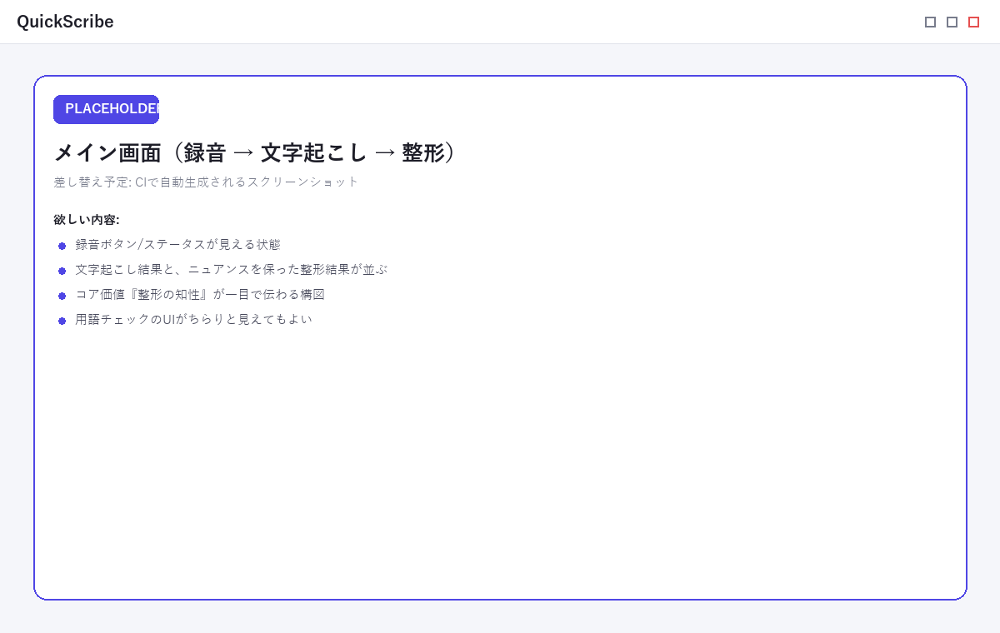

# QuickScribe

**思考整理・自己理解のための、ローカル完結ボイスジャーナル。**
話した内容を、ニュアンスを残しつつ賢く整形・要約し、自分の考えを整理する。

[](https://github.com/Takenori-Kusaka/QuickScribe/releases/latest)
[](https://github.com/Takenori-Kusaka/QuickScribe/actions/workflows/ci.yml)
[](https://github.com/Takenori-Kusaka/QuickScribe/releases)
[](LICENSE)
[](https://takenori-kusaka.github.io/QuickScribe/)
[](CODE_OF_CONDUCT.md)

> 企画・設計の背景は [docs/vision.md](docs/vision.md) と [docs/adr/](docs/adr/) を参照。
> 使い方の詳細・ダウンロードは **[ドキュメントサイト](https://takenori-kusaka.github.io/QuickScribe/)** へ。



> 📸 上記は**プレースホルダ画像**です。実スクリーンショットは v1.0.0 リリース時に **CI で自動生成**して差し替えます（Vite + Playwright でフロントをヘッドレス描画・Tauri IPCをモック）。


## QuickScribe とは

声に出した思考を、**端末内で完結**しながら、**ニュアンスを残したまま整形**して、自分の考えを整理するためのボイスジャーナルです。コア価値は「文字起こし精度」そのものではなく、**思考を整理する整形の知性**にあります。

- 🎙 **録音 → 文字起こし → 整形** をワンフローで。物理ボタン（グローバルホットキー）で素早く開始。
- 🧠 **ニュアンス保持の整形**: 言い淀みや迷いも消し去らず、考えの流れを保ったまま読みやすく整える。用語補正フェーズで誤変換も確認・置換。
- 🔒 **ローカル完結・プライバシー優先**: 録音とローカル文字起こしは端末内で完結。**音声は既定で外部送信されません。** クラウド連携は明示的オプトインのみ。
- 🗂 **ジャーナル**: 記録はプレーンな Markdown / テキストで保存。横断的な振り返り・絞り込みが可能。

## なぜ QuickScribe？（他ツールとの違い）

音声からテキストを作るツールは多くありますが、QuickScribe は**用途を「自分のための思考整理・ジャーナリング」に絞り、ニュアンスを残す整形とローカル完結**に投資しています。

| | 会議ノート系<br>(Otter / Granola) | 高速ディクテーション系<br>(superwhisper 等) | クラウド日記<br>(Day One 等) | **QuickScribe** |
|---|---|---|---|---|
| 主用途 | 会議の要約・議事録 | 素早い文字入力 | 日記（クラウド同期） | **思考整理・自己理解** |
| 整形の思想 | 要約して**捨てる** | 清書・整えるのみ | 手書きのまま | **ニュアンスを残して育てる** |
| プライバシー | クラウド前提 | 多くはクラウド | クラウド同期 | **ローカル完結が選べる**（whisper＋Ollama） |
| 物理トリガー | — | ホットキー中心 | — | ホットキー/物理ボタン/フットスイッチ統合 |

要するに **「要約して捨てる」のではなく「ニュアンスを残して整え、後から見返して育てる」** ——そのための、ローカルで完結できる声のジャーナルです。差別化の詳細は [docs/research/competitive-landscape.md](docs/research/competitive-landscape.md) を参照。

## クイックスタート（ダウンロード）

最新版を **[GitHub Releases](https://github.com/Takenori-Kusaka/QuickScribe/releases/latest)** から入手できます。

| OS | ファイル |
|---|---|
| Windows (x64) | `QuickScribe_<version>_x64-setup.exe` |
| Windows (ARM64) | `QuickScribe_<version>_arm64-setup.exe` |
| Linux (AppImage) | `QuickScribe_<version>_amd64.AppImage` |
| Linux (deb) | `QuickScribe_<version>_amd64.deb` |

インストール後はアプリ内の自動アップデートで最新版に更新されます（配布物の完全性は Tauri updater 署名で担保）。

> **Windows の SmartScreen 警告**: 現在 Windows バイナリは未署名のため「発行元不明」警告が出る場合があります。「詳細情報」→「実行」で起動できます。コード署名は [SignPath Foundation](https://signpath.org/)（OSS向け無償）での整備を進めています。

詳細は **[ダウンロードページ](https://takenori-kusaka.github.io/QuickScribe/download)** を参照。

## プライバシー

QuickScribe は**プライバシーを中核に設計**されています。

- 録音・ローカル文字起こし（whisper.cpp / kotoba-whisper）・整形前処理はすべて端末内で行われ、**音声は既定で外部へ送信されません**。
- **解析・トラッキング・テレメトリは行いません**。
- クラウド文字起こし（Groq/OpenAI/Deepgram/Azure）・AI整形（Gemini/Anthropic/OpenAI/Ollama/AWS）は**明示的にオプトインした場合のみ**、対象データを選択したプロバイダへ送信します。
- APIキーは **OSのセキュアストレージ**（Credential Manager / Keychain / Secret Service）に保存します。

全文は **[プライバシーポリシー](https://takenori-kusaka.github.io/QuickScribe/privacy)** を参照。

## 技術スタック

- Tauri 2（Rust）+ Svelte 5（TypeScript）— [ADR-0005](docs/adr/0005-tech-stack.md)
- 文字起こし: ローカル whisper.cpp 既定（クラウドエンジンも選択可）— [ADR-0002](docs/adr/0002-stt-engine-strategy.md)
- 整形: 複数LLMプロバイダ抽象（Gemini/Anthropic/OpenAI/Ollama/Bedrock 等）

設計の詳細は [docs/design.md](docs/design.md)（アーキテクチャ＋データフロー）、非機能要件は [docs/non-functional-requirements.md](docs/non-functional-requirements.md) を参照。

## 開発

前提: Node 20+, Rust stable, および各OSのTauri依存（Linuxは webkit2gtk-4.1 等）。

```bash
npm ci
npm run icons     # アイコン生成（src-tauri/icons/）
npm run tauri dev # 開発起動
```

フロントの検証は `npm run check` / `npm test`。

### ビルド / リリース

- `main` への push / PR で CI がクロスプラットフォーム(win/linux)ビルドを検証。
- `v*` タグの push で Release ワークフローがインストーラを生成し GitHub Releases へ公開（version はタグ由来で自動設定）。

## コントリビューション

- 開発フロー・規約は [CONTRIBUTING.md](CONTRIBUTING.md)、行動規範は [CODE_OF_CONDUCT.md](CODE_OF_CONDUCT.md) を参照。
- 質問・提案は [Discussions](https://github.com/Takenori-Kusaka/QuickScribe/discussions)、不具合は [Issue](https://github.com/Takenori-Kusaka/QuickScribe/issues) へ。
- セキュリティ上の問題は [SECURITY.md](SECURITY.md) の手順（非公開報告）でお願いします。

## ライセンス

[MIT License](LICENSE)（[ADR-0008](docs/adr/0008-licensing-and-distribution.md)）。

本アプリは whisper.cpp（MIT）・libopus（BSD-3-Clause）・Tauri（MIT/Apache-2.0）等の
オープンソースを利用しています。第三者ライセンスの帰属表記:

- **Rust / ネイティブ依存**: `THIRD-PARTY-NOTICES`（CI で `cargo-about` により自動生成・配布物に同梱）。
- **フロントエンド（npm）依存**: [THIRD-PARTY-NOTICES-frontend.md](THIRD-PARTY-NOTICES-frontend.md)（`npm run licenses` で生成。CI でドリフト検査）。

いずれも MIT / Apache-2.0 等のパーミッシブライセンス（コピーレフトなし）です。
