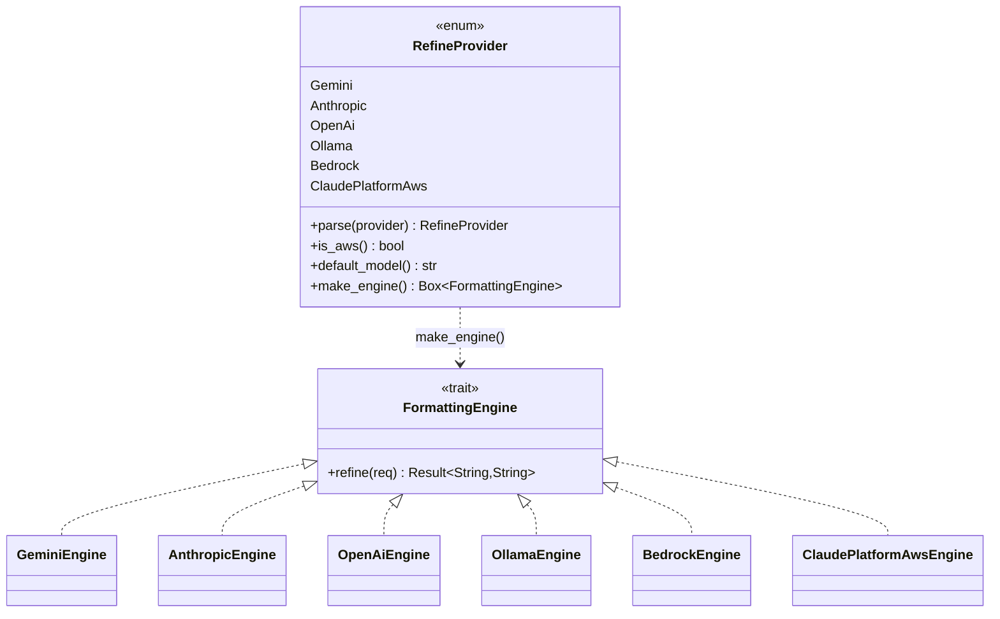

<!-- 連載「ローカル完結ボイスジャーナルの設計」第2章。導入章: https://zenn.dev/takenori_kusaka/books/2b19f675a449f4 -->

> 個人開発OSS「QuickScribe」（ローカル完結ボイスジャーナル）の設計を、要件から実装まで1テーマずつ掘り下げる連載です。今回は「文字起こしエンジンと整形エンジンを、後から差し替えられるようにした設計」を扱います。コードは v1.0.0 時点。設計判断は該当箇所を引用し脚注で出典（ADR＝意思決定記録）を示します。
> リポジトリ: [Takenori-Kusaka/QuickScribe](https://github.com/Takenori-Kusaka/QuickScribe)

このアプリには、音声をテキストにする「文字起こし」と、テキストを整える「整形」という2つの処理があります。どちらも、ローカルで動かすこともできれば、クラウドの各社サービスに投げることもできます。しかも、どれを使うかはユーザーが設定画面で選びます。

この「実行時にユーザーが選ぶ」「プロバイダは今後も増える」「でも呼び出し側は複雑にしたくない」という3つの要求を、Rust の trait とファクトリ関数で解いた話をします。よくある Strategy パターンなのですが、なぜ enum の直接分岐やジェネリクスではなく trait オブジェクトにしたのか、そして同じ問題を2箇所で別々に解いて片方のほうが明らかに良かった、という反省まで含めて書きます。

## 要件整理

文字起こし（STT）と整形（LLM）に共通する要求は次の通りです。

- **複数の実装を持つ**。STT はローカル whisper.cpp とクラウド4種（Groq / OpenAI / Deepgram / Azure）。整形はクラウド/ローカル6種（Gemini / Anthropic / OpenAI / Ollama / Bedrock / Claude Platform on AWS）です。
- **実行時にユーザーが選ぶ**。ビルド時に固定できません。設定に保存された文字列（`"groq"` や `"ollama"` など）から、対応する実装を組み立てます。
- **プライバシー既定に倒す**。未設定・未知の値は、鍵不要でオフライン動作するローカル実装にフォールバックします。これはこのプロダクトのプライバシー約束（音声を既定で外に出さない）と直結します。
- **プロバイダの追加で既存を壊さない**。新しいクラウドが出るたびに、呼び出し側のあちこちを直す設計にはしたくありません。

## 設計ポリシー・狙い

導入章で書いたとおり、このプロダクトの価値の本体は「整形の知性」で、文字起こしの精度は差し替え可能な入り口だと位置づけています。この方針を設計に落とすと、こうなります。価値でない部分（STT）と、将来方針が変わりうる部分（整形をローカルにするかクラウドにするか）を、交換可能な「境界」として切り出す、です。

技術スタックを決めた ADR でも、この境界を設計の中心に据えています[^adr05]。狙いは2つです。

1. **依存の向きを逆にする（DIP）**。上位のオーケストレーション（録音→文字起こし→整形→保存）は、具体的なプロバイダを知りません。抽象（trait）にだけ依存します。おかげで、後から「整形の既定をクラウドからローカルへ」という製品判断を入れても、オーケストレーション側のコードは無傷でした。この判断は実際にあとから入っています[^adr21]。
2. **拡張には開き、変更には閉じる（OCP）**。プロバイダを1つ増やす作業を「実装を1つ足して、解決テーブルに1行足す」だけに閉じ込めます。

## 技術選定：なぜ trait オブジェクトか

「複数の実装から実行時に選ぶ」の実現方法は、Rust では主に3つあります。順に検討しました。

| 候補 | 内容 | 見送った/採った理由 |
|---|---|---|
| enum + match を呼び出し側に直書き | `match provider { "groq" => ..., }` を使う場所ごとに書く | 分岐が呼び出し側に漏れ、プロバイダ追加のたびに全箇所を直すことになる。OCP に反する |
| ジェネリクス `<E: Engine>` | 型パラメータで実装を差し込む | 実装がコンパイル時に確定する必要があり、実行時のユーザー選択に使えない。型が呼び出し連鎖に伝播し、単相化でコードも膨らむ |
| trait オブジェクト `Box<dyn Engine>` | 抽象 trait を1つ定義し、動的ディスパッチで実装を差し替える | 実行時に1つ選んで返せる。呼び出し側は trait だけを見る。動的ディスパッチのコストは、ネットワークやモデル推論の重さに対して無視できる |

STT・整形とも呼び出しは「重い処理を1回」なので、動的ディスパッチのオーバーヘッドは事実上ゼロです。プロバイダ選択という実行時の分岐を、型ではなく値（trait オブジェクト）で表すのが素直でした。

抽象はどちらも小さく保ちました。文字起こし側はこうです[^stt]。

```rust
/// 文字起こしエンジンの抽象（S2.3 / Strategy・DIP 境界）。
pub trait TranscriptionEngine {
    fn transcribe(
        &self,
        audio: &[f32],
        lang: Option<&str>,
        timestamps: bool,
        on_progress: Box<dyn FnMut(i32) + Send>,
        on_segment: Box<dyn FnMut(String) + Send>,
    ) -> Result<String, String>;
}
```

整形側はさらに小さく、1メソッドです。

```rust
pub trait FormattingEngine {
    fn refine(&self, req: &RefineRequest) -> Result<String, String>;
}
```

## 設計アーキテクチャ（C4 コンポーネント図）

コマンド層（`lib.rs`）は、ファクトリ関数 `engine_for` を通してエンジンを1つ受け取り、trait 越しに呼びます。具体的なプロバイダ実装や外部サービスの存在は、コマンド層からは見えません。


境界の外（クラウド各社・ローカル whisper・ローカル Ollama）は、trait の裏側に隠れています。上位はプロバイダの数を知りません。

## システム設計コアポイント（解決点は一箇所）

肝は「文字列からエンジンを組み立てる場所を一箇所に閉じる」ことです。文字起こしは `engine_for(cfg)` がその一点です[^stt]。

```rust
pub fn engine_for(cfg: SttConfig) -> Box<dyn TranscriptionEngine> {
    match cfg.provider.trim().to_ascii_lowercase().as_str() {
        "groq"     => Box::new(OpenAiCompatibleSttEngine { /* Groq のURL・既定モデル */ }),
        "openai"   => Box::new(OpenAiCompatibleSttEngine { /* OpenAI のURL・既定モデル */ }),
        "deepgram" => Box::new(DeepgramSttEngine { /* ... */ }),
        "azure"    => Box::new(AzureSttEngine { /* ... */ }),
        _ => Box::new(LocalWhisperEngine { /* ローカルへフォールバック */ }),
    }
}
```

注目してほしいのは `_ =>`（ワイルドカード）です。未設定・未知の値はすべてローカル whisper に倒れます。これは単なる保険ではなく、「既定は端末内で完結」というプライバシー方針を、型システムの外側（設定文字列の揺れ）に対しても守るための設計です。Groq と OpenAI が同じ `OpenAiCompatibleSttEngine` を共有しているのも、両者が OpenAI 互換APIだからで、実装の重複を避けています。

解決したエンジンがつながる先は、次の関係になります。既定はローカルに閉じ、クラウドは鍵を設定したときだけ外に出ます。


## インターフェース設計コアポイント

trait のシグネチャに、地味だが効いている判断が2つあります。

**1. 進捗と確定テキストを所有クロージャで受ける。** `on_progress: Box<dyn FnMut(i32) + Send>` という型が付いています。文字起こしは重く、UIをブロックできないので別スレッドで走らせ、進捗（0〜100）と確定したセグメントをコールバックで返します。ここで `Send` 境界が必要なのは、whisper.cpp 側のコールバック制約（スレッドを跨いで渡す）に合わせるためです。この制約を trait の型に明示しておくと、実装側がうっかりスレッド安全でないものを渡せなくなります。

**2. エラーは `Result<String, String>` で統一する。** エンジンは失敗を文字列で返し、上位でユーザー向けの安定エラーコードに変換します。プロバイダごとに異なる失敗（鍵なし・ネットワーク・非対応形式）を、境界の内側に閉じ込める契約です。

## クラス図コアポイント

整形側には、文字起こし側にはない「もう一段の集約」があります。プロバイダ文字列の解釈・別名・既定モデル・AWS判定・エンジン生成を、`RefineProvider` という enum に一元化しました[^refine]。もともと `lib` や `refine` に散らばっていた文字列マッチを単一ソースにまとめたものです。



`engine_for(provider)` はこの enum に委譲するだけの薄い関数です。

```rust
pub fn engine_for(provider: &str) -> Box<dyn FormattingEngine> {
    RefineProvider::parse(provider).make_engine()
}
```

文字起こし側（`engine_for` が文字列を直接 match する）と、整形側（`RefineProvider` enum に集約する）で、同じ問題を2通りに解いています。この差が「学び」につながります。

## 実現効果

- **将来性**：新しいクラウドSTT/LLMが出ても、trait を実装して解決点に一行足すだけで載ります。オーケストレーションは変わりません。
- **拡張性**：プロバイダ追加の変更が局所化されています（OCP）。整形側は `RefineProvider` に列挙を1つ、`make_engine` に1行、`parse` に別名を足すだけです。
- **保守性**：整形側はプロバイダにまつわる知識（別名・既定モデル・AWSか）が1つの enum に集まっており、探す場所が決まっています。
- **ユーザビリティ**：ユーザーは設定でプロバイダを選ぶだけです。裏の差し替えは意識しません。
- **セキュリティ／プライバシー**：未知・未設定はローカル実装にフォールバックするので、「設定を間違えたら意図せずクラウドに送られた」が起きません。既定は鍵不要・送信なしです。
- **コスト**：クラウドは鍵を入れた人だけのオプトインで、従量課金は使った分だけです。既定のローカルは無料で動きます。
- アクセシビリティはこの層（バックエンドの抽象境界）には直接関わらないため割愛します。UI 側で別途対応しています。

## 学び、気づき

一番の学びは、同じ設計問題を2箇所で別々に解いてみて、優劣がはっきり出たことです。

文字起こし側の `engine_for` は、文字列を直接 match してエンジンを組み立てます。動きはします。しかし「プロバイダとは何か（別名・既定モデル・種別）」という知識が関数の中に閉じていて、外から問い合わせにくい。一方、整形側の `RefineProvider` enum は、`parse`（別名解釈）・`default_model`・`is_aws`・`make_engine` を1つの型のメソッドとして持ちます。プロバイダに関する問いはすべてこの enum に投げられます。後から見て、enum に集約した整形側のほうが明らかに保守しやすいと感じました。文字起こし側も将来この形（`SttProvider` enum への集約）に寄せる余地があります。

もう1つは、trait の型に制約を書ききる価値です。`Box<dyn FnMut(i32) + Send>` の `Send` は、whisper のスレッド制約を型で表現したものです。ここを緩い型にしていたら、スレッドを跨げないクロージャを渡してしまう事故が、実行時まで見つからなかったはずです。抽象境界は「何を差し替えられるか」だけでなく「差し替える実装が守るべき制約は何か」まで型で語れると、境界が強くなります。

次章では、この trait の裏側でいちばん価値を担う「整形エンジン」が、要約に流れずニュアンスを残すために何をしているかを掘り下げます。

[^adr05]: ADR-0005「技術スタック」より。文字起こし・整形などを差し替え可能な抽象境界として定義し、価値の本体に工数を集中する方針。出典: [docs/adr/0005-tech-stack.md](https://github.com/Takenori-Kusaka/QuickScribe/blob/main/docs/adr/0005-tech-stack.md)

[^adr21]: ADR-0021「ローカルファースト既定」。整形プロバイダの既定を、あとで `gemini` から `ollama`（ローカル）へ変更した判断。抽象境界のおかげで新プロバイダの追加で済んだ。出典: [docs/adr/0021-local-first-defaults.md](https://github.com/Takenori-Kusaka/QuickScribe/blob/main/docs/adr/0021-local-first-defaults.md)

[^stt]: 文字起こしの trait とファクトリの実装。出典: [src-tauri/src/stt.rs](https://github.com/Takenori-Kusaka/QuickScribe/blob/main/src-tauri/src/stt.rs)

[^refine]: 整形の trait・`RefineProvider` enum・ファクトリの実装（#392 でプロバイダ文字列マッチを単一ソース化）。出典: [src-tauri/src/refine.rs](https://github.com/Takenori-Kusaka/QuickScribe/blob/main/src-tauri/src/refine.rs)
