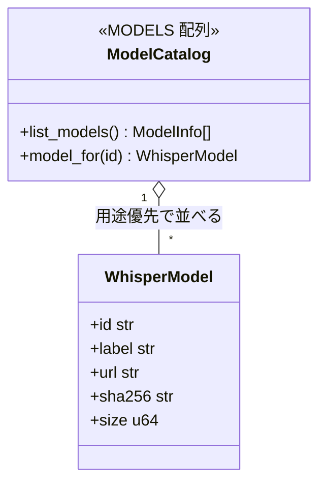

> 個人開発OSS「QuickScribe」（ローカル完結ボイスジャーナル）の設計連載です。第1章で「価値の本体は文字起こし精度ではなく整形の知性だ」と宣言しました。この章は、その宣言を設計でどう裏づけたか ― 精度を「売り」ではなく「回帰監視の対象」に落とし、モデルを削らず用途で導く、という話です。コードは v1.0.0 時点。設計判断は該当箇所を引用し脚注で出典（ADR）を示します。
> リポジトリ: [Takenori-Kusaka/QuickScribe](https://github.com/Takenori-Kusaka/QuickScribe)

音声アプリを作ると言うと、まず「文字起こしの精度はどれくらい？」と聞かれます。でもこのプロダクトは、精度を主戦場にしないと決めました。ローカルで動くWhisper系モデルの普及で、文字起こし精度はもうコモディティです。そこで殴り合っても差はつきません。

とはいえ、「精度は価値でない」は「精度はどうでもいい」ではありません。整形の質は文字起こしの質に乗るので、**劣化していないかは見張る必要がある**。この章は、その「見張り方」と「モデルの並べ方」の設計です。そして最後に、正直に言うと**この見張り方自体がまだ不十分**だという弱点も書きます。

## 要件整理

精度まわりで満たしたかったことは次の通りです。

- **精度を売りにしない**。「精度は何％」を旗印にしない。
- **でも回帰は検知する**。モデルや前処理を変えたときに、精度が落ちていないかをCIで気づける。
- **モデルを1つに絞らない**。用途（言語・下書き・低スペック機）によって最適なモデルは違う。
- **ユーザーを迷わせない**。選択肢は残しつつ、どれを選べばいいかは導く。

## 設計ポリシー・狙い：精度を「指標」でなく「ゲート」にする

狙いは、精度を**主張の材料**から**回帰監視のゲート**へ格下げすることです。「うちは何％です」と誇るのではなく、「前より悪くなっていないか」を機械的に確かめるだけにする。精度がコモディティなら、勝負すべきは絶対値ではなく、劣化させないことです。

そのために、日本語のCER（文字誤り率）をCIで継続的に測ります[^baseline]。ただし**これは絶対精度を主張するための数字ではありません**。相対的な物差し、つまり回帰を検知するためのゲートとして使います。この位置づけを、後で自分の首を絞めるくらい正直に守ります。

## 技術選定：3つの判断

### CERベンチをCIの回帰ゲートにする

固定音源（本人が音読したパブリックドメイン作品3点）を各モデルで認識し、`cer_ja.py`（NFKC正規化・約物空白の除去・文字単位のLevenshtein距離を参照長で割る）でCERを算出します[^baseline]。基準値（`ja-cer-baseline.json`）と比べ、一定のマージンを超えて悪化したらCIを失敗させます。

これで、モデルを差し替えたり前処理を変えたりしたときに、**精度の劣化が自動で赤くなる**。精度を売りにしないと決めても、静かに悪化していくのは困るので、そこだけは機械で押さえます。

### モデルを削らず、用途で並べ替えてラベルで導く

実測すると、日本語ではモデル間に明確な差が出ます。それでも、**精度で劣るモデルを削除はしませんでした**[^adr22]。

```rust
pub const MODELS: &[WhisperModel] = &[
    // base（既定・頑健）→ kotoba-q5（日本語推奨）→ kotoba → small → medium → tiny
];
```

たとえば `tiny` は日本語では精度が低いですが、英語・下書き・低スペック機での最速選択肢としては価値が残ります。日本語で劣るからと消してしまうと、別用途のユーザーの選択肢を一方的に奪うことになる。だから**削るのではなく、用途優先でカタログを並べ替え、ラベルで適否を明示**しました[^adr22]。

- `base`: 「頑健」（既定）、`kotoba-q5`: 「日本語精度◎・日本語推奨」
- `tiny`: 「英語・下書き向き / 日本語は低精度で非推奨」
- `small` / `medium`: 「多言語・英語向き」

「選択肢を減らして簡便にする」のではなく、「選択肢は残して、正しいものへ導く」。これは連載で繰り返してきた「削らずに対処する」の、モデル選択版です。

### 言語別にカタログを出し分けない

「日本語UIなら日本語向きモデルだけ見せる」という出し分けも考えましたが、**採りませんでした**[^adr22]。実装コストが増えるわりに、ラベルによるガイドで十分機能するからです。UIが将来言語別フィルタを持つなら再検討、という線引きにしています。ここでも「今required でない機能は作らない」を通しています。

## 設計アーキテクチャ（C4 コンポーネント図）

CERベンチの構成です。開発者がPRを出すと、固定音源を各モデルで認識し、CERを算出して基準値と比べ、回帰していれば赤で知らせます。モデルカタログが評価対象を供給します。


## システム設計コアポイント（非破壊なモデル解決）

モデルカタログは、順序とラベルを持つ静的な配列です[^adr22]。IDからモデルを解決する `model_for` は、**未知のIDを既定（base）にフォールバック**します。これは、カタログの順序やラベルを変えても、**既存ユーザーの保存済み選択を壊さない**ための非破壊設計です。第5章の「上書きしない」と同じ思想が、モデル解決にも効いています。

精度の回帰監視はCIに寄せてあり、アプリ本体は持ちません。精度はプロダクトの内側で誇るものではなく、開発の外側（CI）で見張るもの、という役割分担です。

## インターフェース設計コアポイント

カタログが外に見せるのは最小です。

- `WhisperModel`：`id` / `label` / `url` / `sha256` / `size`。ダウンロードURLと**整合性検証用のSHA256**を持ちます。
- `list_models()`：UI表示用に `id` と `label` を並び順で返す。
- `model_for(id)`：IDからモデルを解決（未知は base）。

`label` が「用途への導き」、`sha256` が「モデルの改ざん検知」、並び順が「推奨の提示」。カタログというデータ構造そのものが、ユーザーを正しい選択へ導くインターフェースになっています。

## クラス図コアポイント



配列の**並び順が推奨、ラベルが適否のガイド**。テーブル定義ではなく、この静的配列がモデル選択の設計を担います。

## 実現効果

- **将来性**：新しいモデルはカタログに1要素足すだけ。CERベンチが自動で回帰を見張ります。
- **拡張性**：言語別フィルタなどの高度なUIも、既存のカタログ（順序＋ラベル）の上に後から足せます。
- **保守性**：精度の監視がCIに集約され、アプリ本体に精度ロジックが染み出しません。
- **ユーザビリティ**：モデルは消えず、ラベルと並び順で迷わず選べます。
- **セキュリティ**：モデルDLはSHA256で整合性を検証し、改ざんを検知します。
- **コスト**：ベンチは固定音源でCI内完結。外部サービス不要で、回帰監視はほぼゼロコストです。
- アクセシビリティはこの層（精度監視・モデル選択ロジック）からは外れるため割愛します。

## 学び、気づき

一番の学びは、**「価値でない」と決めたものほど、機械で静かに守る**のがよい、ということです。精度を売りにしないと決めたからこそ、精度を人が気にしなくて済むように、CIの回帰ゲートに任せる。旗印から降ろすことと、放置することは違います。降ろしたうえで、劣化だけは自動で押さえる。この配分が、価値の本体（整形）に手を集中させる余地を生みました。

もう1つは、**削らずに導く**という選択です。日本語で劣るモデルを消すのは簡単ですが、それは別用途のユーザーの選択肢を奪います。並べ替えとラベルで導けば、簡便さと網羅性は両立できました。

そして最後に、この章でいちばん正直に書くべき弱点です。**回帰監視の「物差し」そのものが、まだ心もとない**。現状のCERは、本人が音読したパブリックドメイン作品3点（N=3）で測っていて、原文にルビが混ざって値が悲観側に振れます。だから私は一貫して「絶対精度の主張には使わない、相対/回帰の指標だ」と断ってきました。しかしこれは裏を返せば、**評価のサンプルの作り方や指標そのものを、根本から見直す必要がある**ということです。「サンプルが悪かっただけでは」と言われたら、今の私は反論しきれません。公開コーパスでの計測、正規化でのルビ除去、十分なサンプル数と信頼区間 ― このあたりを作り直す宿題として、別に切り出してあります。精度を旗印にしないと決めても、その「劣化を測る物差し」は、旗印にする以上にきちんとしていないといけない。ここはまだ道半ばです。

---

## おわりに（連載のまとめ）

本連載「ローカル完結ボイスジャーナルの設計」は、これで全章そろいました。通して書いてきたのは、ひとつの問いへの答えです。**価値の本体はどこにあり、本体でない部分をどれだけ交換可能・機械化・非破壊にできるか**。

- 文字起こしと整形は trait の裏に隠して差し替え可能にし（第2章）、
- 整形の知性はプロンプトの不変条件として守り（第3章）、
- プライバシーは既定と表示の正直さで担保し（第4章）、
- 記録はプレーンファイルで捨てずに残し（第5章）、
- 起動は公式手段への橋渡しで全デバイスに開き（第6章）、
- 精度はコモディティ扱いして回帰監視に落とす（本章）。

そして各章で、うまくいった判断だけでなく、**まだできていないこと**（ニュアンス保持の計測、アプリ内の横断発見、Ollamaの導入摩擦、そして本章の評価方法そのもの）も正直に書いてきました。設計は完成品ではなく、判断の記録です。もし同じような個人開発をするなら、最初に決めるべきは道具ではなく、「自分のプロダクトにとって価値の本体は何か、そこ以外をどう軽くするか」だと思います。ここまで読んでいただき、ありがとうございました。

[^baseline]: 日本語CERの計測方法（固定音源・`cer_ja.py`・回帰ゲート）と、その位置づけ（N=3・原文ルビ混入で悲観側・相対/回帰指標であって絶対精度の主張には使わない）。出典: [docs/perf/baseline.md](https://github.com/Takenori-Kusaka/QuickScribe/blob/main/docs/perf/baseline.md)

[^adr22]: ADR-0022「モデルカタログ精選」。精度で劣るモデルも削除せず、用途優先でカタログを並べ替え、言語別の適否をラベルで明示する。言語別のカタログ出し分けは実装コスト増で不採用。未知IDは base フォールバック（非破壊）。出典: [docs/adr/0022-model-catalog-curation.md](https://github.com/Takenori-Kusaka/QuickScribe/blob/main/docs/adr/0022-model-catalog-curation.md)
