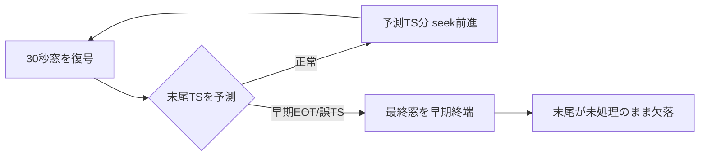

> 個人開発OSS「QuickScribe」（ローカル完結ボイスジャーナル）の設計連載、追章です。第7章で私は「文字起こし精度で殴らない ― コモディティ扱いして回帰監視に落とす」と書きました。その公開後、実利用で見つかった不具合をきっかけに、**自分のその判断を実測で補正する**ことになりました。うまくいった話ではなく、**公開した設計判断を録音1本で覆した記録**です。コードは v1.2.0 時点。事実は一次情報を引用し脚注で示します。
> リポジトリ: [Takenori-Kusaka/QuickScribe](https://github.com/Takenori-Kusaka/QuickScribe)

## 事件：11分の録音の、最後が消えた

ある日、11分40秒の独り言を録音して文字起こしにかけたところ、**末尾が[00:11:16]で止まり、そこから先が失われて**いました。音声はまだ24秒続いているのに、文字起こしはそこで凍結し、最後は同じトークンの反復（`I I I I …`）で埋まっていました。

第7章で「精度はコモディティ、劣化だけ回帰ゲートで押さえればよい」と書いた手前、これは笑えない事態でした。**整形の知性がどれだけ効いても、入力の文字起こしが末尾ごと欠落していたら、その部分の価値はゼロ**です。整形は無から情報を作れません。

## 解剖：なぜ末尾が消えるのか（と、効かなかった対策）

whisper.cpp の長尺文字起こしは **sequential long-form** という方式です。30秒の窓をスライドさせ、**モデルが予測した末尾タイムスタンプの分だけ次の窓へ seek（前進）**します。窓を跨ぐ発話や、末尾タイムスタンプの予測が狂うと、seek が最終窓を早期に打ち切り、そこで文字起こしが終わってしまう[^whisper]。

問題は、当時の日本語既定モデル **kotoba-whisper（q5量子化）** にありました。kotoba は distil-whisper 方式で、**デコーダを2層に蒸留**した高速モデルです[^kotoba]。速度の源泉であるこの薄いデコーダが、同時に**長尺の末尾タイムスタンプ/終端予測を弱く**します。量子化がそれをさらに削ります。結果、seek が最終窓を早期終端し、末尾が消えました。

まず私は**対症療法**を試しました。反復ループを助長する「前文脈への条件付け」を切る設定（`no_context=true`）を入れると、`I I I I` の反復は消えました。**しかし末尾の早期終端は直りませんでした**（停止位置がむしろ [11:21] → [11:16] と早まった）。パラメータ調整では根治しなかったのです。試して外した記録として残します。

## 上位の問い：対症療法か、それとも既定が間違っているのか

ここで、レビューをくれた利用者（＝このプロダクトの Decider）から鋭い指摘がありました。「その調査は問題の重さに対して軽い。**そもそも既定モデルが正しいのか**、文字起こしが壊れれば全価値がゼロになるという土台に対して、モデル選定という一段上を問うべきだ」と。

これは第7章で引いた[問い設計メソッド](docs/research/question-framing-method.md)そのものでした。目の前の窓の欠落を潰す（対症）のではなく、**「日本語の既定に kotoba を選び続けてよいか」**という意思決定に問いを引き上げる。行動を変える問いに賭け直したわけです。

## 測る道具を、先に作る

覆すにしても、**感覚で「turbo の方が良さそう」では第7章の自分に顔向けできません**。ちょうどこの連載の作業中に、日本語CERを**公開コーパス（Common Voice / FLEURS）＋正規化＋ブートストラップ95%信頼区間**で測る評価基盤を作っていました[^adr24]。「絶対精度を主張する」ためではなく、**モデル選定を数値と不確実性込みで比べる物差し**として使います。

そして最も直接的な証拠として、**利用者の実録音そのもの**を各モデルに通し、タイムスタンプの到達点と処理時間（RTF）を測りました。クリーンな公開コーパスは実利用（自発発話の独り言）とドメインが違うので、**実録音での実測を併用する**——評価基盤の弱点を自覚したうえでの二段構えです。

## 判定：3つのモデルを、同じ録音で

同じ11分40秒（音声長 11:40）を、no_context を入れた同一コードで測った結果です。

| モデル | 末尾到達（タイムスタンプ） | 末尾欠落 | RTF（当該CPU） | 会話CER（外部ベンチ） |
|---|---|---|---|---|
| base | [00:11:39] | なし | 0.13（最速） | 中 |
| **kotoba-q5（旧既定）** | [00:11:16] | **約24秒欠落** | 0.90 | **0.495** |
| **large-v3-turbo** | [00:11:34]（実文末まで） | 実質なし | 1.15（低速） | 0.184 |

読み取れたのは3つの事実でした。**敬意をもって**書きます。

1. **kotoba は、この用途で末尾を落とす**。base（[11:39] 到達）や turbo（[11:34] で実文末まで）が拾えている終盤を、kotoba だけが落としました。
2. **kotoba は自発発話（会話）で崩れる**。外部の独立ベンチで、会話・報道音声の CER が kotoba 0.495 に対し turbo 0.184[^neosophie]。kotoba は TV 音声（自前学習ドメイン）に最適化された蒸留モデルで、**「悪い」のではなく、私の用途（長尺・自発発話のジャーナル）と適合しなかった**のです。クリーンな朗読や高速性ではむしろ優秀で、その設計目的は尊重すべきものです。
3. **kotoba のコア重みは停滞している**。最後の重み更新は2024年で、運営組織は商用サービスへ注力を移しています（これは価値判断でなく、公開情報から読み取れる事実）[^kotoba]。

一方で、**turbo を万能解として持ち上げるのも誠実ではありません**。同じ外部ベンチでは、whisper.cpp の外にある Qwen3-ASR が 0.140 で turbo を上回っています[^neosophie]。turbo を選んだのは「最強だから」ではなく、**whisper.cpp 互換・一次配布での入手性・自分の実測、のバランスで現時点の最善**だからです。より良い候補は評価の余地として ADR に残しました。

## 決定：モデルは交換し、"壊れないこと"は機械化する

判断は明快になりました。**日本語の既定を kotoba-whisper から large-v3-turbo へ変更**する[^adr25]。会話精度と長尺末尾の確実性を優先します。kotoba はカタログに残し（静音・朗読向けの選択肢）、base は速く頑健なフォールバックに。turbo の欠点は速度（当該CPUで RTF 1.15＝11分音声に約13.5分）なので、低スペック機は base へ誘導します。

この移行が綺麗だったのは、**モデルが最初から交換可能な抽象の裏にあった**からです（第2章の trait 境界）。既定値を1つ差し替えるだけで、無停止で主力を入れ替えられました。そして「文字起こしが壊れないこと」は、人が毎回目視するのではなく、**CERベンチ＋CI回帰監視という機械に委ねる**。これは連載の背骨「価値の本体以外を交換可能・機械化・非破壊にする」の、そのままの実演でした。

## 反転：コモディティと、"壊れてはいけない土台" は別物だった

第7章で私は「精度で殴らない」と書きました。それ自体は今も正しいと思います。文字起こし精度はコモディティで、そこで差別化はできない。**上を目指して殴り合う軸ではない**。

でも私は、大事な一語を抜かしていました。**「殴らない（＝差別化しない、天井を目指さない）」ことと、「壊れてもよい」ことは、まったく別**です。文字起こしは差別化軸ではないが、**床（floor）**です。床が抜ければ、その上に載る整形の知性も、ニュアンス保持も、育てる体験も、すべて一緒に落ちる。

第7章に足すべきだったのは、**floor という第三の概念**でした。コモディティだから上は追わない。だが floor は**監視して死守する**。そのために評価基盤（回帰ゲート）を持ち、実測で既定を選び直す。「精度で殴らない、しかし床は抜かせない」——これが、公開した自分の判断を録音1本で覆して得た補正です。

## 学び、気づき

一番の学びは、**設計判断は「公開したら終わり」ではなく、実測で更新され続けるべき**だということです。連載で「これが正しい」と書いたことを、実利用の1つの故障がひっくり返す。それは連載の失敗ではなく、**設計が生きている証**だと思うことにしました。ADR に「なぜ」を残していたからこそ、「なぜ変えるか」も筋道立てて書けました（ADR-0025 は ADR-0021 の改訂として、却下案と反証条件つきで残しています）。

もう1つは、**Decider の一言の重さ**です。「調査が軽い」「タイムスタンプで見よ」という指摘がなければ、私は対症療法（パラメータいじり）で満足し、既定が用途に合っていないという本丸に踏み込めませんでした。一人開発でも、価値の本体を握る人の視点が、問いの階層を上げてくれる。

最後に、正直な弱点を2つ。**評価基盤のコーパス（Common Voice / FLEURS）は、実利用の自発発話ジャーナルとドメインが違います**。だから実録音での実測を併用しましたが、体系的な「会話ドメインの自前評価セット」はまだありません。そして**長尺の末尾欠落は、既定を turbo にして実用上は解消しましたが、モデルに依らない根治（発話区間でチャンク分割して whisper 内部の seek に頼らない）はこれからの宿題**です。turbo でも30秒窓の構造的リスクは残ります。floor を守り切るには、まだ床板を1枚打ち足す必要があります。

---

これで本連載は、当初の7章に加えて、この追章までそろいました。設計は完成品ではなく、判断の記録です。そして時に、その判断は**自分の手で覆されて、初めて本物になる**のだと思います。ここまで読んでいただき、ありがとうございました。

[^whisper]: whisper の長尺文字起こしは30秒窓を末尾タイムスタンプで継ぐ sequential 方式で、窓を跨ぐ発話やタイムスタンプ予測の誤りが末尾の取りこぼしを生む。VADで発話区間を外挿してチャンク化する回避が定番（WhisperX）。出典: [WhisperX (arXiv:2303.00747)](https://arxiv.org/pdf/2303.00747) / [ggml-org/whisper.cpp issue #3744（長尺の反復・文脈持ち越し）](https://github.com/ggml-org/whisper.cpp/issues/3744)

[^kotoba]: kotoba-whisper v2.0 は distil-whisper 方式（デコーダ2層に蒸留）で高速。公式モデルカードは長尺に chunked long-form を推奨する（whisper.cpp/sequential は非対応）。出典: [kotoba-tech/kotoba-whisper-v2.0（モデルカード）](https://huggingface.co/kotoba-tech/kotoba-whisper-v2.0) / [同 ggml](https://huggingface.co/kotoba-tech/kotoba-whisper-v2.0-ggml)

[^neosophie]: 第三者の日本語ASRベンチ（会話・報道・バラエティ音声）で、CER は large-v3-turbo 0.184、kotoba-whisper-v2.0 0.495、Qwen3-ASR-1.7b 0.140。turbo は whisper.cpp 外の候補（Qwen3等）に精度で上回られており、万能解ではない。出典: [Neosophie 日本語ASRベンチ 2026](https://neosophie.com/ja/blog/20260226-japanese-asr-benchmark)

[^adr24]: ADR-0024「評価基盤の再設計」。日本語CERを公開コーパス（Common Voice/FLEURS）＋正規化＋発話単位ブートストラップ95%信頼区間で測る。絶対精度の主張でなく回帰監視とモデル比較の物差し。出典: [docs/adr/0024-evaluation-redesign-cer-and-nuance.md](https://github.com/Takenori-Kusaka/QuickScribe/blob/main/docs/adr/0024-evaluation-redesign-cer-and-nuance.md)

[^adr25]: ADR-0025「日本語の既定STTモデルを kotoba-whisper から large-v3-turbo へ（実測に基づく）」。実録音のタイムスタンプ到達点・RTF・会話CER・保守継続性を根拠に既定を変更。却下案（base既定/kotoba継続/full large-v3/ReazonSpeech）と反証条件つき。出典: [docs/adr/0025-japanese-default-model-revision.md](https://github.com/Takenori-Kusaka/QuickScribe/blob/main/docs/adr/0025-japanese-default-model-revision.md)
