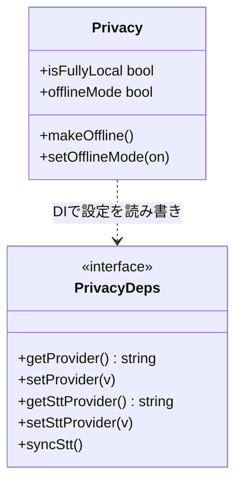

> 個人開発OSS「QuickScribe」（ローカル完結ボイスジャーナル）の設計連載、第4章です。前章では整形の中身を書きました。今回は、その整形やSTTを「ローカルに閉じる」という価値を、どう既定とUIに落とし込んだかを書きます。コードは v1.0.0 時点。設計判断は該当箇所を引用し脚注で出典（ADR）を示します。
> リポジトリ: [Takenori-Kusaka/QuickScribe](https://github.com/Takenori-Kusaka/QuickScribe)

第1章で「ローカルプライバシーそのものはコモディティだ」と書きました。ローカルで完結することは、もう珍しくありません。では何で差がつくのか。私の答えは、**既定をどちらに倒すか**と、**現状を正直に見せられるか**の2点です。この章は、正直に言うと**自分が一度やらかした過剰主張を、どう是正したか**の記録でもあります。

## 要件整理

プライバシーまわりで満たしたかったことは次の通りです。

- **既定でローカルに倒す**。「設定を変えた人だけ安全」ではなく、何もしなくても端末内で完結する。
- **今どうなっているかを正直に見せる**。整形やSTTにクラウドを選べば、当然データは送信されます。それを隠さず表示する。
- **クラウドから一手でローカルへ戻せる**。プライバシーが気になったら、ワンクリックでオフラインに固定できる。
- **選択肢を増やしすぎない**。プライバシー設定でトグルが林立すると、簡便さが死にます。核心課題「リッチすぎると簡便でなくなる」がここにも効きます。

## 設計ポリシー・狙い：誠実さを仕組みにする

このプロダクトの差別化は「ローカルプライバシー」ですが、それ単体はコモディティです。差がつくのは**既定と表示の誠実さ**だ、というのが設計の出発点です[^adr19]。

ここで白状します。初期のUIは「話した言葉はこの端末から出ません」と表示していました。ところが当時の**既定の整形はクラウド**（鍵を入れて使うクラウドLLM）だったので、この表示は**実態に反する過剰主張**でした。ユーザーがクラウドを選んでいれば、言葉は端末から出ています。この矛盾を是正したのが、この章で書く設計です。

狙いは2つです。**表示を「主張」ではなく「現在の構成からの導出」にする**こと。そして最終的に、**既定そのものをローカルに動かす**こと。前者で嘘をつかなくし、後者で「何もしなくても安全」を実現します。

## 技術選定：3つの判断

### 表示を主張でなく導出にする

「オンデバイス完結」という表示を、固定の文言ではなく、**現在の設定から計算する値**にしました。整形がローカル、かつSTTがローカルのときだけ真になる `isFullyLocal` です[^privacy]。

```typescript
const isFullyLocal = $derived(
  LOCAL_PROVIDERS.includes(deps.getProvider()) &&
    deps.getSttProvider() === "local",
);
```

これが真のときだけ「オンデバイス完結」、それ以外は「クラウド送信あり」と出します[^adr19]。表示は設定に追従して自動で変わるので、**UIが実態と食い違う余地がありません**。過剰主張は「頑張って正しい文言を書く」ではなく、「文言を状態から導く」ことで構造的に潰しました。

### トグルは1つに留める

プライバシーを気にしたユーザーのために、**「オフラインにする」をワンクリック**で提供します。押すと整形をローカル（Ollama）、STTをローカルwhisperに固定します[^privacy]。

```typescript
function makeOffline() {
  deps.setProvider("ollama");
  deps.setSttProvider("local");
  deps.syncStt();
}
```

ここで「プロバイダごとに送信可否のトグルを並べる」設計もあり得ましたが、採りませんでした。トグルが増えるほど、ユーザーは「結局いま安全なのか」を判断できなくなります。**状態はインジケータ1つで見せ、切り替えはボタン1つ**。核心課題への回答です。

### 既定をローカルへ動かす（重い判断は記録する）

最初のプライバシー可視化（ADR-0019）では、あえて**既定は変えませんでした**（クラウドのまま）。既定変更はユーザー体験を大きく動かすので、「Deciderの承認と新しい意思決定記録が要る」と条件を付けて保留したのです[^adr19]。

その後、条件を満たして既定を動かしました。**整形の既定をクラウド（Gemini）からローカル（Ollama）へ、日本語STTの既定を kotoba-whisper へ**変更する判断です[^adr21]。これで新規ユーザーは、何も設定しなくても端末内で完結します。「既定は最強のメッセージ」で、どれだけUIで安全性を訴えても、既定がクラウドなら本気度は伝わりません。

## 設計アーキテクチャ（C4 コンポーネント図）

設定（プロバイダ選択）から `isFullyLocal` を導出し、インジケータに表示する。クラウドを選んだときだけ外部へ送信し、「オフラインにする」は設定をローカルへ上書きする。この関係を図にすると次の通りです。


## システム設計コアポイント（テスト可能な純粋ロジックにする）

UIのプライバシーロジックは、Appの設定stateに直接触らず、**依存を注入（DI）**して受け取る形にしました[^privacy]。プロバイダの読み書きとSTT同期を関数として外から渡します。

```typescript
export interface PrivacyDeps {
  getProvider: () => string;
  setProvider: (v: string) => void;
  getSttProvider: () => string;
  setSttProvider: (v: string) => void;
  syncStt: () => void;
}
```

こうすると、`isFullyLocal` の真偽や「オフラインにすると本当にローカルへ切り替わるか」を、UIを起動せずにユニットテストできます。プライバシーという**間違えてはいけないロジックほど、UIから引き剥がして単体で検証**する、という判断です。実際に「ローカル整形＋ローカルSTTのときだけ true」「makeOffline がローカルへ切り替える」といったテストが対になっています。

## インターフェース設計コアポイント

状態モジュールが外に見せるものは最小です[^privacy]。

- `isFullyLocal`（読み取り専用の導出値）＝ 今オンデバイス完結か。
- `offlineMode`（永続化される固定モード）＝ ONの間はローカルに固定。
- `makeOffline()` / `setOfflineMode(on)` ＝ ローカルへ切り替える／固定する操作。

「読み取れるのは実態、変更できるのはローカルへ倒す方向だけ」という非対称が、そのまま外向きのインターフェースになっています。UIはこの状態を読んで表示を出すだけで、判断ロジックを持ちません。

## クラス図コアポイント



`isFullyLocal` が導出（読み取り専用）、`makeOffline`/`setOfflineMode` が「ローカルへ倒す」操作、という構造がこの章の要点です。

## 実現効果

- **将来性**：プロバイダが増えても、ローカル判定は「ローカル集合に含まれるか」で決まるので、集合を更新するだけです。
- **拡張性**：オフライン固定モードは永続化され、将来「クラウド選択を完全に無効化する」強い固定へも拡張できます。
- **保守性**：プライバシー判定が `isFullyLocal` の一箇所に集約され、UIの各所に散りません。
- **ユーザビリティ**：状態はインジケータ1つ、切替はボタン1つ。迷いません。
- **セキュリティ／プライバシー**：表示が実態から導出されるため過剰主張が起きません。既定がローカルなので、無設定でも端末内で完結します。
- **コスト**：既定のローカルは無料。クラウドは選んだ人だけ従量。
- アクセシビリティはこの層の設計判断からは外れるため割愛します（UI側で別途対応）。

## 学び、気づき

一番の学びは、**誠実さは気持ちではなく仕組みで担保する**ということです。「嘘をつかないUI文言を書こう」と気をつけるのではなく、**文言を状態から導出**してしまえば、実態と食い違いようがありません。過剰主張をやらかした反省から得た、いちばん効いた設計判断でした。

もう1つは、**既定は最強のプライバシー表明**だという点です。どれだけUIで安全を語っても、既定がクラウドなら本気度は伝わりません。既定をローカルに動かす判断は重く、意思決定記録を分けてまで慎重に進めましたが、動かして初めて「何もしなくても安全」が本当になりました。

最後に正直な弱点を1つ。**既定をローカル整形にした代償として、Ollama が入っていないと初回の整形が失敗します**[^adr21]。明確なエラーとクラウドへの即切替は用意しましたが、Ollama の同梱や自動セットアップはまだ手つかずです。「何もしなくても安全」は達成しましたが、「何もしなくても動く」にはもう一歩足りていません。ここは今後の宿題です。

次章では、整えた記録を「捨てずに残して育てる」ためのデータ設計 ― 中間ファイルとスキーマの持ち方を書きます。

[^adr19]: ADR-0019「プライバシー状態の可視化と『オフラインにする』導線」。初期UIの過剰主張（実態はクラウド送信）の是正、`isFullyLocal` による状態表示、トグルを1つに留める判断。出典: [docs/adr/0019-privacy-indicator-and-offline-mode.md](https://github.com/Takenori-Kusaka/QuickScribe/blob/main/docs/adr/0019-privacy-indicator-and-offline-mode.md)

[^adr21]: ADR-0021「ローカルファースト既定」。整形の既定を `gemini` から `ollama`（ローカル）へ、日本語STTの既定を `kotoba-q5` へ変更した判断と、Ollama 未導入だと初回整形が失敗するというトレードオフ。出典: [docs/adr/0021-local-first-defaults.md](https://github.com/Takenori-Kusaka/QuickScribe/blob/main/docs/adr/0021-local-first-defaults.md)

[^privacy]: プライバシー状態モジュール（`isFullyLocal` の導出、`makeOffline` / `setOfflineMode`、依存注入 `PrivacyDeps`）の実装。出典: [src/lib/privacy.svelte.ts](https://github.com/Takenori-Kusaka/QuickScribe/blob/main/src/lib/privacy.svelte.ts)
