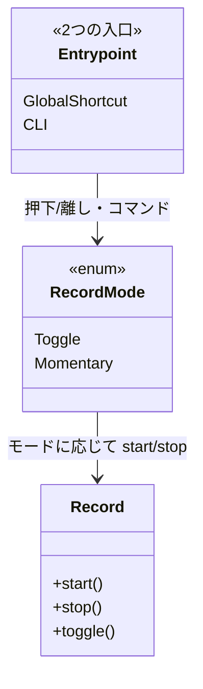

> 個人開発OSS「QuickScribe」（ローカル完結ボイスジャーナル）の設計連載も終盤です。ここまでアーキテクチャ・整形・プライバシー・データ設計と、中身の話をしてきました。今回は入口の話、つまり物理ボタンひとつで「話す→整形→残す」を摩擦なく始める体験をどう設計したかです。コードは v1.0.0 時点。設計判断は該当箇所を引用し脚注で出典（ADR）を示します。
> リポジトリ: [Takenori-Kusaka/QuickScribe](https://github.com/Takenori-Kusaka/QuickScribe)

思考を音声で吐き出すツールにとって、最大の敵は「起動の面倒くささ」です。アプリを探して、ウィンドウを開いて、録音ボタンを押して…とやっているうちに、頭に浮かんだことは逃げていきます。だから、**Stream Deck やフットスイッチのような物理ボタンひとつで、いきなり録音を始められる**ことを差別化のひとつに置きました。

ただ、この章のいちばんの学びは「差別化のために自分で頑張って作った」話ではありません。むしろ逆で、**独自のデバイス連携を作らないと決めたこと**、そして**唯一やった小さな設計改修**が効いた、という話です。

## 要件整理

物理トリガーまわりで満たしたかったことは次の通りです。

- **物理ボタンで録音を起動できる**。Stream Deck、ゲーミングマウスのサイドボタン、フットスイッチなど、手元のデバイスから一発で。
- **押している間だけ録音（momentary / hold-to-record）もできる**。トグルだけでなく、押しっぱなしで話し、離したら止まる、という使い方も。DragonやOBS、Discordで定着しているUXです。
- **特定デバイスに縛られない**。「このアプリはStream Deck専用」にはしたくない。
- **簡便さを壊さない**。設定を増やしすぎない。核心課題「リッチすぎると簡便でなくなる」はここでも効きます。

## 設計ポリシー・狙い：作らないことで全対応にする

最初に調べて分かったのは、**物理デバイスは各エコシステムの公式手段で、既存のホットキーへコード変更ゼロで橋渡しできる**ということでした[^adr14]。Stream Deck には組み込みの「Hotkey」アクションがあり、Logitech の Options+、Razer の Synapse、プログラマブルなHIDフットスイッチも、任意のキーを送れます。

つまり、QuickScribe 側に**設定可能なグローバルホットキー**が1つあれば、あとは各デバイスをそのホットキーに割り当てるだけで、すべての物理デバイスに対応できます。独自のデバイスAPIやプラグインを書く必要はありません。むしろ書くと、デバイスごとの保守が増え、移植性が落ちます。

そこで方針はこうなりました。**トグル起動はドキュメントだけで全デバイス対応**（コード変更ゼロ）。QuickScribe が書くコードは最小にし、各デバイスの割り当て手順をガイドとして提供する。「作らない」ことが、いちばん広く対応する道でした。

## 技術選定：3つの判断

### 独自デバイスコードを書かない

候補は「デバイス固有のコードを書く」対「公式手段のホットキーへ橋渡しする」でした。後者を採りました[^adr14]。理由は、公式手段で十分に全デバイスをカバーでき、独自実装はコストと脆弱性を増やすだけだからです。ホットキーには**F13–F24 の使用を推奨**しています。これらは通常のキーボードには無い（＝タイピングと衝突しない）ので、割り当て先として安全です。

加えて、**CLI からも起動できる**ようにしました。`quickscribe --toggle-record` のようなコマンドで、single-instance の仕組みを使って実行中のプロセスへ転送します。LogitechやRazerのように任意コマンドを起動できるデバイスは、こちらを直接叩けます。ホットキーとCLI、2つの入口を用意して、デバイス側の得意な方に合わせられるようにしました。

### 唯一の設計改修：録音APIを start/stop に分離する

ここがこの章の肝です。当初、録音の起動点は「トグル」しか持っていませんでした。押すたびに録音の開始と停止が切り替わる方式です。しかしこれだと、**押している間だけ録音する（momentary）が後付けできません**。トグルしか無いのは、実は片手落ちのアンチパターンでした[^adr14]。

そこで、**録音APIを内部で明示的な start と stop に分離**しました。トグルは「今録音中なら stop、そうでなければ start」という上位の組み合わせに、momentary は「押されたら start、離されたら stop」という組み合わせに、それぞれなる。**下位に start/stop を持てば、トグルも momentary も上位で構成できる**わけです。

これは「機能を削らずに分割・抽象化で最終ゴールを保つ」という、この連載で何度も出てきた方針の実例です[^adr14]。トグルを捨てて momentary にするのでも、両方を別々に実装するのでもなく、start/stop という一段下の抽象を置くことで、両方が自然に出てきます。CLI にも `--start-record` / `--stop-record` を足しました。

### momentary は Pressed/Released で受け、release delay を添える

押している間だけの録音は、グローバルショートカットの**押下（Pressed）と離し（Released）**を拾って実現します[^shortcut]。停止時には短い **release delay**（末尾切れ防止）を入れます。指を離した瞬間に切ると、最後のひと言が欠けがちなので、少しだけ録音を延ばす。これはOBSやDiscordでも使われる定石です。

録音モード（トグル / 押している間）は設定で選べますが、**既定はトグルのまま**にしました。momentary は強力ですが、設定面が増えるぶん、既定にすると初見の人の簡便さを損なうからです。強い機能はオプトインで、既定はシンプルに。

## 設計アーキテクチャ（C4 コンポーネント図）

物理デバイスから、公式手段でホットキーを送るか CLI を起動し、録音モードに応じて start/stop する。この橋渡しの構成です。

## システム設計コアポイント（2つの入口が同じ start/stop に合流する）

肝は、**ホットキーとCLIという2つの入口が、最終的に同じ start/stop に合流する**ことです。どちらの入口から来ても、録音モード（トグル / momentary）の解釈を通って、下位の start/stop を叩きます。入口が増えても、録音の本体ロジックは1つに保たれます。

グローバルホットキーの登録はバックエンドで行います[^shortcut]。設定されたアクセラレータ（例: `F13`）を解釈し、既存の登録を解除してから登録し直す。パースや登録の失敗は、ユーザー向けの安定エラーコードに変換します（第2章で触れたエラー設計と同じ流儀です）。

## インターフェース設計コアポイント

外向きの起動点は次のように整理されています。

- **グローバルホットキー**：`set_record_shortcut(accelerator)` で登録。押下/離しを受ける。
- **CLI**：`--toggle-record` / `--start-record` / `--stop-record`。single-instance で実行中プロセスへ転送。
- **録音モード設定**：トグル / 押している間。

物理デバイスは、この「ホットキーを送る」か「CLIを起動する」のどちらかさえできれば繋がります。**デバイスの多様性を、2つの汎用的な入口に集約する**のがインターフェース設計の狙いでした。

## クラス図コアポイント

`start`/`stop` という下位の分離があるから、`Toggle` も `Momentary` も、2つの入口も、同じ土台の上に乗る。この一段の抽象がこの章の要点です。

## 実現効果

- **将来性**：新しい物理デバイスが出ても、公式手段でホットキー/CLIに割り当てられる限り、コード変更なしで対応できます。
- **拡張性**：start/stop の分離により、将来「録音状態の視覚フィードバック」などデバイス側の高度な連携（カスタムプラグイン）も、既存の起動点の上に足せます。
- **保守性**：デバイス固有コードが無いので、保守対象はホットキーとCLIの2つだけ。デバイスの数だけコードが増えることはありません。
- **ユーザビリティ**：物理ボタンひとつで話しはじめられ、押している間だけの録音も選べます。既定はトグルで簡便なまま。
- **セキュリティ／プライバシー**：起動はローカルのホットキー/CLIで完結。外部サービスを介しません。
- **コスト**：追加のハードウェアSDKもクラウドも不要。手持ちのデバイスで動きます。
- アクセシビリティはこの層（起動の橋渡し）からは外れますが、物理ボタン対応そのものが、キーボード操作が難しい人の入力手段になり得ます。

## 学び、気づき

一番の学びは、**統合体験は「自分で作る」より「プラットフォームの公式手段に乗る」ほうが広く強い**ということです。Stream Deck専用の凝った連携を作り込むより、「任意のホットキーに割り当ててください」というガイド1枚のほうが、結果的にあらゆるデバイスに対応できました。差別化＝独自実装、とは限りません。既存の公式手段を正しく前提にする設計判断も、りっぱな差別化です。

もう1つは、**小さな抽象の分離が、大きな機能を後から開く**ことです。トグルしか無かった録音APIを start/stop に割っただけで、momentary という差別化UXが自然に乗りました。機能を最初から全部作り込むのではなく、「一段下の抽象」を置いておくと、あとで上位を組み替えるだけで新しい体験が生まれる。この連載で繰り返し出てきた「削らずに分割する」の、いちばん小さくて分かりやすい実例でした。

最後に正直な弱点を1つ。ボタン面での録音状態の視覚フィードバックや、Stream Deck上でのmomentary保持といった、より凝った連携（カスタムプラグイン）は**まだ作っていません**。これらが本当に必要になったら、今の start/stop の土台の上に足す計画です。「必要になるまで作らない」を、ここでも通しています。

次章（最終章）では、この入口から入ってきた音声の「精度」を、なぜ競争軸にしないと決めたか ― 文字起こしをコモディティ扱いして回帰監視に落とす設計を書きます。

[^adr14]: ADR-0014「物理トリガー連携」。独自デバイスAPIを作らず、各エコシステムの公式手段（Stream Deck組み込みHotkey / Logi / Razer / HIDフットスイッチ）へ橋渡しする方針。加えて、F13–F24推奨、録音APIをstart/stopに分離してモーメンタリを後付け可能にする、既定はトグルのまま、という判断も含む。出典: [docs/adr/0014-physical-trigger-integration.md](https://github.com/Takenori-Kusaka/QuickScribe/blob/main/docs/adr/0014-physical-trigger-integration.md)

[^shortcut]: グローバルショートカットの登録（`set_record_shortcut`）と、押下/離し（`ShortcutState::Pressed`/`Released`）のハンドリング。`tauri-plugin-global-shortcut` を使用。出典: [src-tauri/src/lib.rs](https://github.com/Takenori-Kusaka/QuickScribe/blob/main/src-tauri/src/lib.rs)
