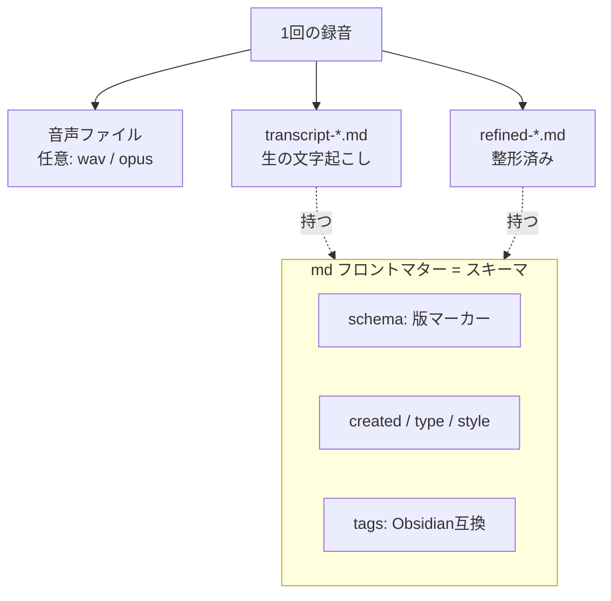

> 個人開発OSS「QuickScribe」（ローカル完結ボイスジャーナル）の設計連載、第5章です。前章まではプライバシーと整形の話でした。今回は、整えた記録を「捨てずに残して育てる」ためのデータ設計を書きます。中間ファイルの持ち方と、将来フォーマットが変わっても壊れない仕組みです。コードは v1.0.0 時点。設計判断は該当箇所を引用し脚注で出典（ADR）を示します。
> リポジトリ: [Takenori-Kusaka/QuickScribe](https://github.com/Takenori-Kusaka/QuickScribe)

このプロダクトのコア価値は「残して育てる」です。要約して捨てるのではなく、ニュアンスを残し、あとから見返して育てる。第3章では「整形で捨てない」を書きましたが、この章は**保存で捨てない**、つまりデータ設計の話です。

結論から言うと、選んだのは**プレーンなファイル**です。データベースは使いません。地味な選択ですが、「捨てない」「育てる」を本気でやるなら、これがいちばん筋が通っていました。

## 要件整理

保存に求めたことは次の通りです。

- **中間生成物を捨てない**。音声・生の文字起こし・整形後、この3つを必要に応じて残せる。整形結果だけが唯一の成果物ではありません。
- **上書きしない**。保存で既存の記録を失わない。
- **外部ツールで育てられる**。同じファイルを Obsidian などで開いて、タグや全文で横断できる。ローカル完結だからこそできる強みです。
- **将来フォーマットが変わっても壊れない**。形式を更新しても、既存ファイルを失わない土台を持つ。

## 設計ポリシー・狙い：可搬なプレーンファイルに賭ける

狙いは、**記録を自分のアプリに閉じ込めない**ことです。データベースに入れると速度や検索では有利ですが、記録がアプリの中に囲い込まれ、外部ツールで育てにくくなります。「ローカル完結だから外部エコシステムで自由に育てられる」という強みと、独自DBは相性が悪い。

そこで、記録は**Markdown（またはテキスト）ファイルそのもの**として保存し、メタデータはYAMLフロントマターに載せる方針にしました[^adr17]。可搬性を最優先し、独自DB・独自インデックスは**却下**しています。この判断は「リッチにすると簡便でなくなる」という核心課題とも一致します。

## 技術選定：3つの判断

### 中間生成物を種別で残す

保存する記録には「種別」を持たせました。生の文字起こし（`transcript`）、整形済み（`refined`）、任意メモ（`note`）です[^entry]。ファイル名の先頭にこの種別が付くので、**生の文字起こしと整形済みを名前で見分けられます**。

```rust
pub fn filename_prefix(kind: &str) -> &'static str {
    match kind {
        "transcript" => "transcript", // 生の文字起こし
        "refined" => "refined",       // 整形済み
        _ => "note",
    }
}
```

音声も、必要なら WAV や Ogg Opus で残せます（保存しなければ完全にメモリ内で完結）[^audio]。**音声 → 生の文字起こし → 整形**という流れの、どの段階も捨てずに手元に置ける。「整形をやり直したい」「元の言い回しを確かめたい」というときに、中間に戻れます。これが「捨てない」の実体です。

### スキーマ版をフロントマターに刻む

将来フォーマットを変えたくなったときに既存を壊さないため、**エントリのスキーマ版をMarkdownフロントマターに埋め込みます**[^adr17]。

```
---
schema: 1
created: "2026-07-05T10:00:00"
type: "refined"
style: "structured"
tags: ["設計", "振り返り"]
---

（本文）
```

そして、**パーサは版の欠落や未知の版を許容**します（古いファイルは版0とみなす）。読み取り時に解釈するだけで、**既存ファイルを勝手に書き換えません**（非破壊）。txt形式には版を付けず最小に保ちます。「今すぐ移行処理を書く」のではなく、**版マーカーと寛容なパーサ＝将来の移行の土台**までを置く、という線引きです。実移行が要らない段階で移行コードを書くのは、オーバーエンジニアリングだからです。

Obsidianなどが未知のフロントマターキーを足しても壊れない、という副次効果もあります。外部で編集して育てても、こちらの読み取りは壊れません。

### 非破壊保存を不変条件にする

保存は**上書きしない**を絶対条件にしました[^entry]。同じ秒に2つ保存しても、名前が衝突したら `stem-2`, `stem-3` と一意名に退避します。

```rust
fn next_unique_name(stem: &str, ext: &str, exists: impl Fn(&str) -> bool) -> String {
    // 衝突しなければそのまま。衝突したら stem-2, stem-3 … を試す。
}
```

書き込み自体も一時名で書いてから rename する方式で、途中で失敗しても既存ファイルを壊しません。`exists`（存在判定）を引数で注入しているのは、ファイルシステムなしでこのロジックを単体テストするためです。**記録を失わないという不変条件ほど、純粋関数に切り出してテストで守る**という判断です。

## 設計アーキテクチャ（C4 コンポーネント図）

保存サブシステムの構成です。音声保存（任意）・本文組み立て・非破壊保存を通って、保管庫はプレーンファイルとして残り、同じファイルを外部ツールで開いて育てられます。


## システム設計コアポイント（本文組み立ては純粋関数）

本文の組み立ては、ファイルシステムに触らない**純粋関数** `build_document` に切り出しました[^entry]。種別・スタイル・タグ・スキーマ版・作成時刻を渡すと、mdならフロントマター付き、txtなら末尾にタグ行、という本文を**決定的に**返します。

- md: `schema` / `created` / `type` /（あれば）`style` / `tags` のフロントマター＋本文。
- txt: 本文のみ。タグがあれば末尾に `Tags: a, b` 行（形式に依らずタグは残す）。

決定的な純粋関数なので、「このメタデータならこの本文になる」をテストで固定できます。保存という副作用の重い処理から、本文の組み立てというロジックを引き剥がしてあるわけです。

## データ設計コアポイント（ファイルとフロントマターがスキーマ）

このプロダクトにはリレーショナルDBがありません。**ファイルとフロントマターがそのままスキーマ**です。1回の録音から、捨てずに残せる成果物の関係を図にすると次の通りです。



`schema` が将来の非破壊移行の土台、`tags` が外部ツールでの横断（育てる）の入口、`type` が生と整形の区別。**データの意味が、DBのテーブル定義ではなく、人とツールの双方が読めるプレーンなフロントマターに書いてある**のがこの設計の要点です。

## 実現効果

- **将来性**：スキーマ版マーカーと寛容なパーサがあるので、フォーマットを変えても既存を壊さず移行できます（版N→N+1）。
- **拡張性**：新しい種別やメタデータは、フロントマターにキーを足すだけ。既存ファイルは無効になりません。
- **保守性**：本文組み立てと一意名生成が純粋関数に集約され、副作用（ファイルIO）と分離してテストできます。
- **可搬性**：記録がプレーンなmd/txtなので、Obsidianなどの外部ツールでそのまま横断・グラフ化できます。アプリに囲い込まれません。
- **セキュリティ／プライバシー**：保存もローカル完結。記録は端末のファイルとして手元にあります。
- **コスト**：DBサーバもクラウドストレージも不要で、保存はほぼゼロコストです。
- アクセシビリティはこの層（保存ロジック）からは外れるため割愛します。

## 学び、気づき

一番の学びは、**「捨てない」はデータ設計に落として初めて本物になる**、ということです。理念として「残して育てる」と言うのは簡単ですが、それを保証するのは、中間生成物を種別で残す・上書きしない・可搬な形式で持つ、という地味な決定の積み重ねでした。

そして、**あえてDBにしない勇気**です。DBは便利ですが、記録をアプリに囲い込み、外部で育てる自由を奪います。ローカル完結の強みを活かすなら、プレーンファイルのほうが筋が通る。速度や検索で不利になる部分は、必要になってから足せばよい。実際、スキーマの移行処理は「必要になるまで書かない」と決めました。土台（版マーカー＋寛容なパーサ）だけ置いて、実装は先送りする。これはオーバーエンジニアリングを避ける判断でもありました。

最後に正直な弱点を1つ。**「育てる」の肝心なところ、つまりアプリ内での横断発見（複数の記録から問いや傾向を見つける）は、まだ実装できていません**。今はタグを付けて保存するところまでで、横断はObsidianなどの外部ツール頼みです。可搬な形式にした甲斐あって外部では育てられますが、アプリ内で完結して「育てる」を見せるのはこれからです。ここは別の宿題として切り出してあります（ローカル埋め込みによる関連記録の提示や、週次の問い生成の設計）。

次章では、この「話す→整形→残す」の入口、物理ボタンひとつで起動から着地までを摩擦なくつなぐ統合体験を書きます。

[^adr17]: ADR-0017「スキーマ版管理と非破壊マイグレーション」。エントリは md/txt のプレーンファイル、スキーマ版を md フロントマターに刻む、パーサは版の欠落/未知を許容し既存を書き換えない（非破壊）、独自DB/インデックスは却下。出典: [docs/adr/0017-schema-versioning-and-migration.md](https://github.com/Takenori-Kusaka/QuickScribe/blob/main/docs/adr/0017-schema-versioning-and-migration.md)

[^entry]: エントリ本文の組み立て（`build_document`）、種別プレフィックス（`filename_prefix`）、非破壊の一意名生成（`next_unique_name`）の実装。いずれも純粋関数でテスト対象。出典: [src-tauri/src/entry.rs](https://github.com/Takenori-Kusaka/QuickScribe/blob/main/src-tauri/src/entry.rs)（保存フローは lib.rs）

[^audio]: 録音音声の保存（WAV / Ogg Opus）。保存しない場合はメモリ内で完結する。出典: [src-tauri/src/audio_save.rs](https://github.com/Takenori-Kusaka/QuickScribe/blob/main/src-tauri/src/audio_save.rs)
