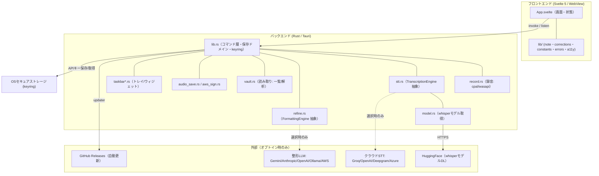
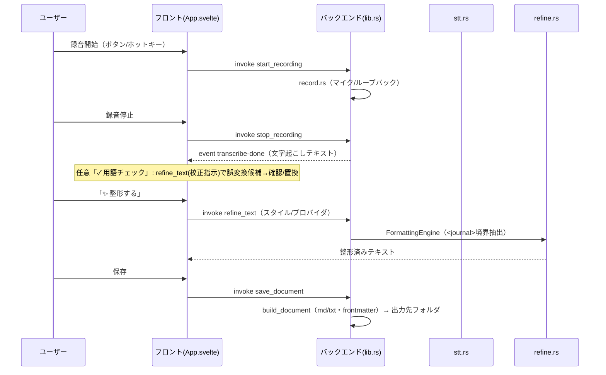

# QuickScribe アーキテクチャ設計（design.md）

> Status: Living（2026-06-28 初版）。実装（v0.6.x）と整合させる基本設計。
> 「なぜ」は [ADR](adr/) に、要件は [vision](vision.md) と [non-functional-requirements](non-functional-requirements.md) に対応する。

## 1. 全体構成

QuickScribe は Tauri 2 のデスクトップアプリ。**Rust バックエンド（ネイティブ機能・I/O・外部API）** と
**Svelte 5 フロントエンド（WebView UI）** が Tauri の `invoke`（コマンド）と `event`（イベント）で通信する。
プライバシー設計上、**録音とローカル文字起こしは端末内で完結**し、外部送信はユーザーが明示選択した場合のみ。

## 2. コア・データフロー（録音 → 文字起こし → 用語補正 → 整形 → 保存）

ファイル入力（`transcribe_file`）も同様。復号前に **サイズ上限ガード**（[#397](https://github.com/Takenori-Kusaka/QuickScribe/issues/397)）を通す。

## 3. 主要な抽象境界（差し替え可能性 / OCP・DIP）

| 抽象 | 場所 | 実装 |
|---|---|---|
| `TranscriptionEngine` | `stt.rs` | ローカル whisper / OpenAI互換(Groq・OpenAI) / Deepgram / Azure（[ADR-0002](adr/0002-stt-engine-strategy.md) / [ADR-0016](adr/0016-cloud-stt-providers.md)） |
| `FormattingEngine` | `refine.rs` | Gemini / Anthropic / OpenAI / Ollama / Bedrock / Claude Platform on AWS（[ADR-0011](adr/0011-aws-providers-bedrock-and-claude-platform.md)） |
| 録音ソース `SourceKind` | `record.rs` | input(マイク) / loopback(システム音) / mix（[ADR-0013](adr/0013-system-audio-loopback-and-source-unification.md)） |
| 保管ドメイン | `lib.rs`(書き) / `vault.rs`(読み) | Markdown/テキスト・frontmatter・スキーマ版（[ADR-0017](adr/0017-schema-versioning-and-migration.md)） |
| プロバイダ/定数(フロント) | `src/lib/constants.ts` | SSOT集約（[#401](https://github.com/Takenori-Kusaka/QuickScribe/issues/401)） |

新プロバイダ追加は trait 実装の追加で済む（既存コードを変更しない＝OCP）。

## 4. フロント／バックエンド境界

- **invoke コマンド**（フロント→Rust）: `start_recording`/`stop_recording`/`transcribe_file`/`refine_text`/`save_document`/`list_entries`/`read_text_file`/`set_*_settings`/`set_secret`/`get_secret` 等。
- **event**（Rust→フロント）: `status`/`progress`/`segment`/`transcribe-done`/`transcribe-error`、物理トリガー（`toggle-record`/`record-press`/`record-release`）。
- **秘密情報**: APIキー/AWS資格情報は **OS keyring** に保存し、バックエンドへはメモリ内注入のみ（永続化しない）。フロントの localStorage には非秘密設定のみ。

## 5. プラットフォーム配布

- ビルド/署名: [ADR-0012](adr/0012-windows-multiarch-multisimd-distribution.md)（x64/ARM64・決定的AVX2・CPUガード）。
- 自動更新: Tauri updater（minisign 署名）。配布: GitHub Releases（AppImage/deb/NSIS）。
- リリース運用: release-please（[#400](https://github.com/Takenori-Kusaka/QuickScribe/issues/400)）＋ タグ駆動 `release.yml`。

参照: [non-functional-requirements.md](non-functional-requirements.md)（性能・可用性・セキュリティ・プライバシーの目標と測定）。
